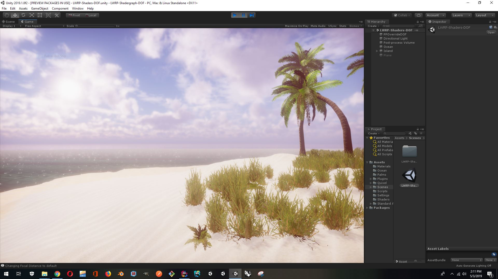
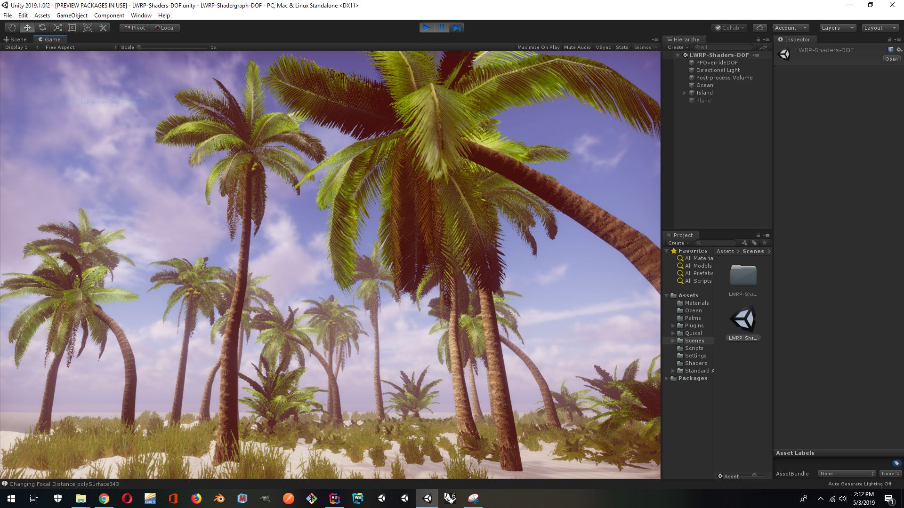

### **LWRP-Shadergraph-DOF**

A Unity3D Test project, experimenting with the default LWRP setup and playing around with a few different techniques:
1. Foliage movement and animation using Shadergraph
    - improving default 
2. Scripted Depth of Focus changes [from keijiros github project ](https://github.com/keijiro/PostProcessingUtilities) 
3. Dynamic plane generation ([from Brackeys tutorial](https://www.youtube.com/watch?v=64NblGkAabk))
3. Enhancing the Ocean shader (from the Unity tutorial - [Creating Animated materials with Shadergraph](https://blogs.unity3d.com/2018/10/05/art-that-moves-creating-animated-materials-with-shader-graph/))

This project utilizes a few free resources, attributed here:

**Palm Tree models: from Turbo Squid** : https://www.turbosquid.com/3d-models/free-obj-mode-palm-trees/490485

**Ferns**: from the built in LWRP demo

**Sand Texture**:  https://www.deviantart.com/marlborolt/art/Sand-Ripples-439027940

**Skybox**: https://cgi.tutsplus.com/articles/freebie-8-awesome-ocean-hdris--cg-5684

###### **To Do**
- Ocean foam at beach terrain intersection
- VFX for sand surface particles
- Add a boat, and swaying rope
- Try to use Shadergraph to animate birds and crabs